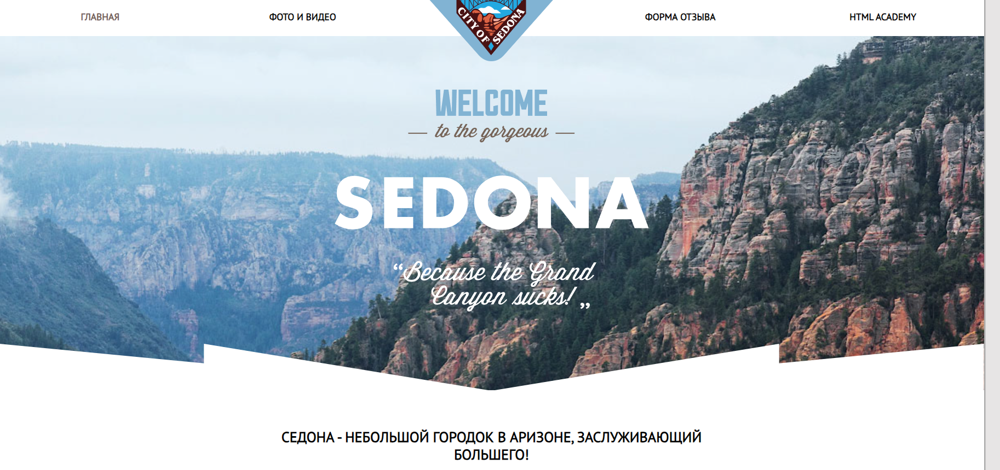
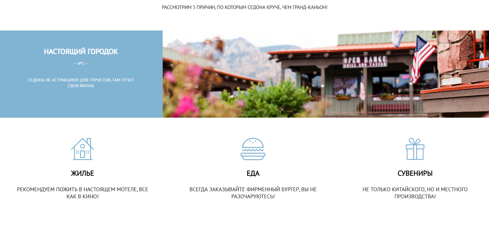
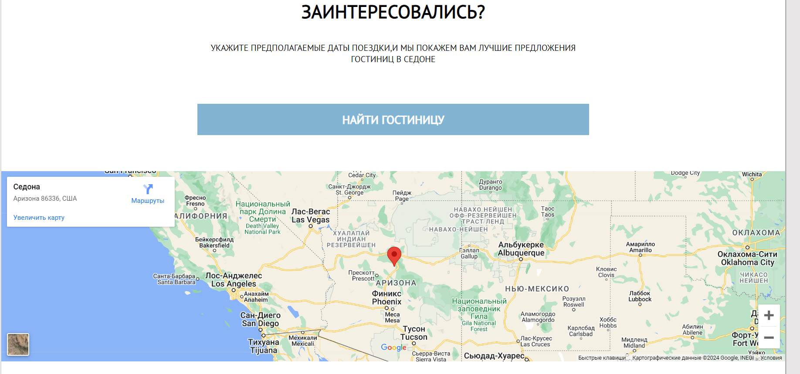
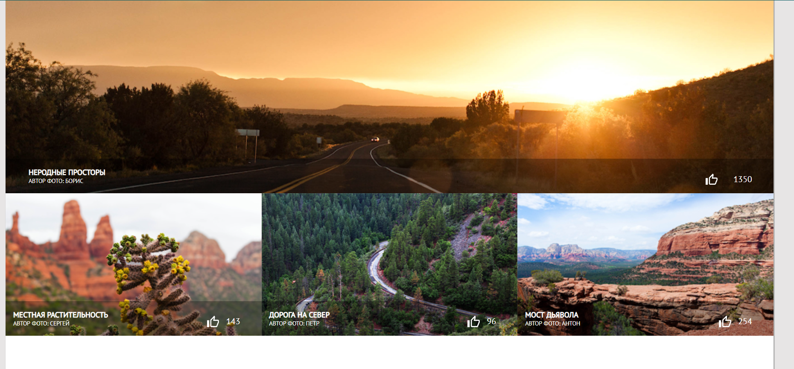
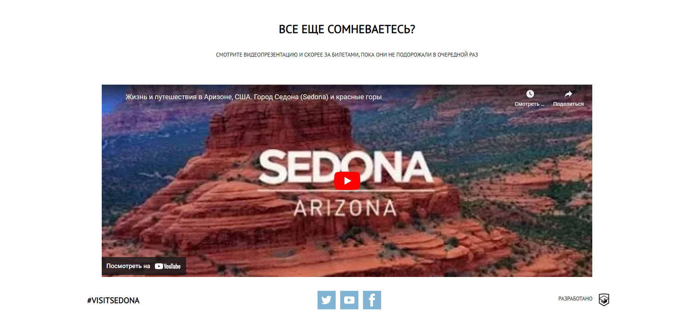
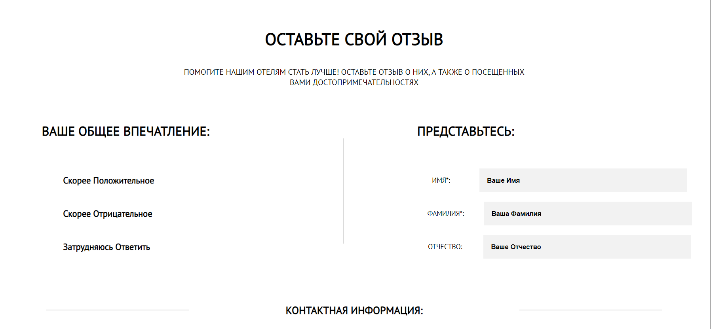

# Проект: Sedonia -дипломная работа Innopolis
## Описание Проекта 
Проект Седония реализован в качестве дипломной работы для завершения курса "Фронтенд-разработчик" в 2020 г.
В данном проекте отработаны навыки верстки и написание минимальной логики на React.
## Используемые технологии
1.HTML
2.CSS
3.JS
4.React
5.Webpack
## Инструкции по установке и запуску
1. Клонируйте репозиторий: `git clone git@github.com:k0t1k777/HR_Space.git`
2. Перейдите в директорию проекта: `cd HR_Space`
3. Установите зависимости: `npm install`
4. Запустите проект: `npm run start`
## Скриншоты

